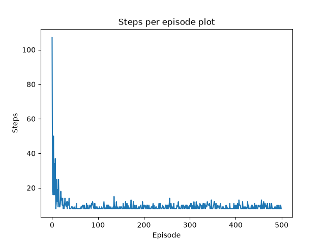
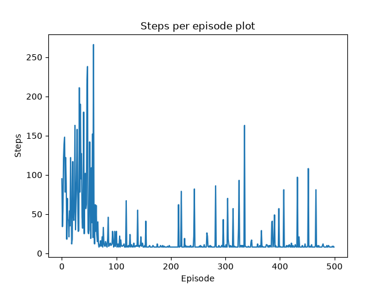
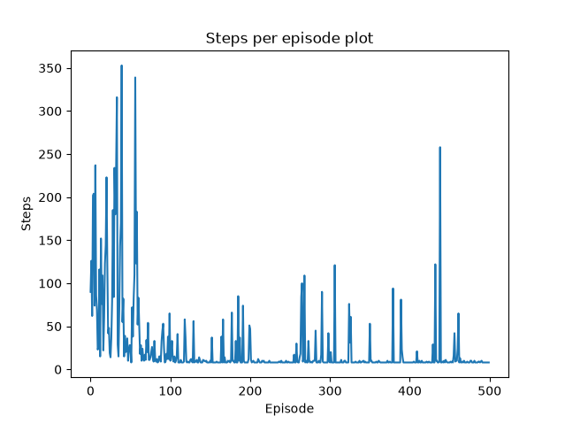
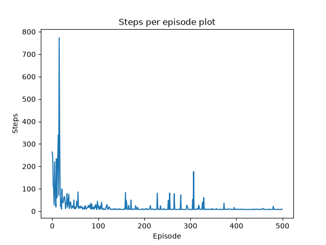

# GridWorld Reinforcement Learning

The repository contains the complete implementation of both **Tabular Q-Learning** and **Deep Q-Network (DQN)** on a simple GridWorld environment.

 While developing the DQN agent, several training instabilities emerged, leading to a series of experiments to identify and resolve the underlying issues.

Once the DQN agent reached stable performance, additional experiments were conducted to study its learning behavior across multiple independent training runs. Some of the results were expected, while others revealed interesting characteristics of deep reinforcement learning.

While a 5×5 GridWorld is a relatively simple environment, repeated experiments reveal surprisingly rich learning dynamics. For anyone new to reinforcement learning, it offers an accessible way to observe how exploration, convergence, and training variability influence an agent's behavior.

**[Explore the complete experiment notebook](report/analysis.ipynb)**

The notebook is the core of this project. it documents:

- the implementation process,
- debugging and iterative improvements,
- experimental results,
- performance analysis,
- and observations from repeated training runs.

**If you're interested in how a DQN behaves beyond a single successful training run, the notebook is the best place to start.** 

## The Environment

The custom environment is a **5×5 GridWorld** with deterministic actions and static obstacles. The agent's objective is to navigate from the start position to the goal state while maximizing cumulative rewards.

### Grid Layout

```text
S . . . .
. X . X .
. X . . .
. . X . .
. . . . G
```

- **S**: Start position `(0,0)`
- **G**: Goal state `(4,4)`
- **X**: Wall / Obstacle
- **.**: Free space

### Action Space

Discrete actions:

- Up
- Down
- Left
- Right

### Reward Structure

| Event | Reward |
|--------|-------:|
| Standard step | **-1** |
| Move out of bounds | **-5** |
| Hit a wall | **-10** |
| Reach the goal | **+100** |

The reward design encourages the agent to find the shortest valid path while avoiding invalid moves.

---

## 1. Tabular Q-Learning

A classical reinforcement learning algorithm designed for environments with small, discrete state spaces.

The Q-values are updated using the Bellman equation:

<p align="center">

$$Q(s,a)\leftarrow Q(s,a)+\alpha\left[r+\gamma\max_{a'}Q(s',a')-Q(s,a)\right]$$

</p>

The agent consistently learns the optimal shortest-path policy, requiring fewer steps as training progresses.



---

## 2. Deep Q-Network (DQN)

Instead of storing values in a Q-table, DQN approximates the action-value function using a **Multi-Layer Perceptron (MLP)** implemented with **PyTorch**.

### Features

- Experience Replay Buffer
- Target Network
- ε-greedy exploration
- Adam optimizer
- Mean Squared Error (MSE) loss

Target value:

<p align="center">

$$y=r+\gamma\max_{a'}Q_{\text{target}}(s',a')$$

</p>

---

## Experiments

The project focused on developing and improving the Deep Q-Network (DQN) agent. Once the DQN agent was successfully implemented, we ran it repeatedly under the same environment and analyzed its behavior across multiple independent training runs. The notebook discusses the architectural decisions, training procedure, and experiments that led to this final implementation.







> Feel free to try your own experiments

---

## Prerequisites & How To Run

- Python 3.12+

Install dependencies:

```bash
pip install -r requirements.txt
```
## Running the Agents

### The Q-Learning Agent

```bash
python3 -m src.qlearning.train_qlearning
```

### The DQN Agent

```bash
python3 -m src.dqn.train_dqn
```
---

## Repository Structure

```text
.
├── README.md
├── requirements.txt
├── outputs/
├── report/
│   └── analysis.ipynb 
└── src/
    ├── gridworld.py
    ├── util.py
    ├── qlearning/
    └── dqn/
```

## Technologies Used

- Python
- NumPy
- PyTorch
- Matplotlib
- Jupyter Notebook

---